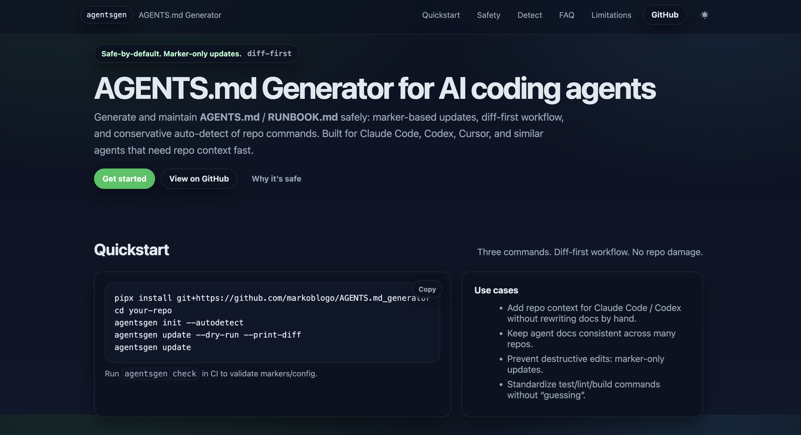

# AGENTS.md Generator (`agentsgen`)

[](https://github.com/markoblogo/AGENTS.md_generator/actions/workflows/ci.yml)
[](https://github.com/markoblogo/AGENTS.md_generator/actions/workflows/pages/pages-build-deployment)
[](https://github.com/markoblogo/AGENTS.md_generator/releases)
[](LICENSE)
[](pyproject.toml)



Small, production-grade CLI to generate and safely update:

- `AGENTS.md` (strict repo contract for coding agents)
- `RUNBOOK.md` (human-friendly command/run cheatsheet)

## Safety Model

The tool is safe-by-default and follows a strict 3-mode policy per file:

1. File missing: create it with marker sections.
2. File exists and markers exist: update only content inside markers.
3. File exists but markers missing: do not modify it; write `*.generated.md` instead.

Marker format:

```md
<!-- AGENTSGEN:START section=commands -->
... generated content ...
<!-- AGENTSGEN:END section=commands -->
```

## Install (from source)

```sh
python3 -m venv .venv
. .venv/bin/activate
pip install -e .
```

## Quickstart

Install (recommended for dev tools):

```sh
pipx install git+https://github.com/markoblogo/AGENTS.md_generator.git
```

Generate files (autodetect on by default):

```sh
agentsgen init --defaults
```

Preview changes safely:

```sh
agentsgen update --dry-run --print-diff
```

Apply updates + validate:

```sh
agentsgen update
agentsgen check
```

Generate LLMO bundle (safe marker updates, same overwrite policy):

```sh
agentsgen pack --autodetect --dry-run --print-diff
agentsgen pack
agentsgen pack --check
agentsgen pack --format json --dry-run
```

Uninstall:

```sh
pipx uninstall agentsgen
```

## GitHub Action: PR Guard

Use the reusable `agentsgen-guard` action to fail PRs when `AGENTS.md` / `RUNBOOK.md` are missing or out of date.

```yaml
name: agentsgen-guard

on:
  pull_request:

permissions:
  contents: read
  # pull-requests: write  # only if comment: "true"

jobs:
  guard:
    runs-on: ubuntu-latest
    steps:
      - uses: actions/checkout@v4
      - uses: markoblogo/AGENTS.md_generator/.github/actions/agentsgen-guard@v0.1.1
        with:
          path: "."
          files: "AGENTS.md,RUNBOOK.md"
          comment: "false"
          pack: "true"  # optional: also enforce `agentsgen pack --check`
          pack_format: "json"
          # pack_autodetect: "true"
          # pack_llms_format: "md"
          # pack_output_dir: "docs/ai"
          # pack_files: |
          #   llms
          #   SECURITY_AI.md
```

- Optional PR comment: set `comment: "true"` and grant `pull-requests: write`.
- Fork-safe by default: no extra secrets required.
- `files` input is an action-level filter for reported file findings; core validation still runs through `check_repo`.
- `pack: "true"` enforces `agentsgen pack --autodetect --check` in the same guard run.
- Example workflow: `.github/workflows/agentsgen-guard.example.yml`
- Full action docs: `docs/gh-action.md`

## Usage

```sh
agentsgen init
agentsgen update
agentsgen pack
agentsgen check
agentsgen init --defaults --stack python --dry-run --print-diff
pipx uninstall agentsgen
```

## LLMO Pack

`agentsgen pack` generates an AI/LLMO-ready documentation bundle:

- `llms.txt` (or `LLMS.md` with `--llms-format md`)
- `docs/ai/how-to-run.md`
- `docs/ai/how-to-test.md`
- `docs/ai/architecture.md`
- `docs/ai/data-contracts.md`
- `SECURITY_AI.md`
- `CONTRIBUTING_AI.md`
- `README_SNIPPETS.md`

What it is:
- a compact, agent-first context bundle for coding agents and LLM indexing.

What it is not:
- not a traffic/SEO promise, and not a full developer handbook replacement.

### Why it matters
- **Less agent babysitting.** Repos with `AGENTS.md` + `docs/ai/` reduce back-and-forth and "where is X?" questions for Codex/Claude.
- **Safer automation by default.** Marker-only updates + `*.generated.*` fallback prevents accidental overwrites of hand-written docs.
- **CI keeps it honest.** `agentsgen-guard` + `agentsgen pack --check` catches drift early, before docs rot and agents start hallucinating.

Safety model is identical to `init`/`update`:

1. Missing file -> create with markers.
2. Existing file with markers -> update only marker sections.
3. Existing file without markers -> keep original and write `*.generated.*`.

See full details: `docs/llmo-pack.md`.

## Known Limitations

- Auto-detect is intentionally conservative (file heuristics only; no “smart” analysis).
- Monorepos may detect as `mixed`, and commands can be empty on purpose (better empty than wrong).
- If a Makefile exists, Makefile targets win over other toolchains by design.
- Templates are minimal for v0.1.x: `python`, `node`, `static`.
- The tool only owns content inside `AGENTSGEN` marker sections; keep custom content outside markers.

## Landing Page (GitHub Pages)

This repo includes a minimal one-page landing in `docs/index.html`.

- GitHub: Settings -> Pages
- Source: Deploy from a branch
- Branch: `main`
- Folder: `/docs`

## Snapshot Commits

If you want cheap “backup commits” with a green-test gate:

```sh
make snapshot
```

This runs `ruff format`, `ruff check`, `pytest`, then commits only if there are changes and tests are green.

## Definition Of Done (DoD)

- `agentsgen init` works in an empty folder and creates:
  - `.agentsgen.json`
  - `AGENTS.md`
  - `RUNBOOK.md`
- `agentsgen update`:
  - updates only marker sections
  - preserves content outside markers
  - writes `*.generated.md` if markers are missing
- `agentsgen check` returns non-zero exit code on problems
- 3 smoke tests exist: `python -m agentsgen._smoke`
  - init in empty dir creates files
  - edit outside markers persists after update
  - no-markers files produce `*.generated.md` and leave originals untouched

## Contributing

Template PRs welcome (shared sections and stack-specific notes).

## Releasing

- Use checklist: `docs/release-checklist.md`
- Write release notes: `RELEASES/template.md -> RELEASES/vX.Y.Z.md`
- Run: `./scripts/release.sh vX.Y.Z A|B|C`
- Shorthand: `./scripts/release.sh A` (auto-suggests next version)
- Tags follow `vX.Y.Z` and should point to the release commit
