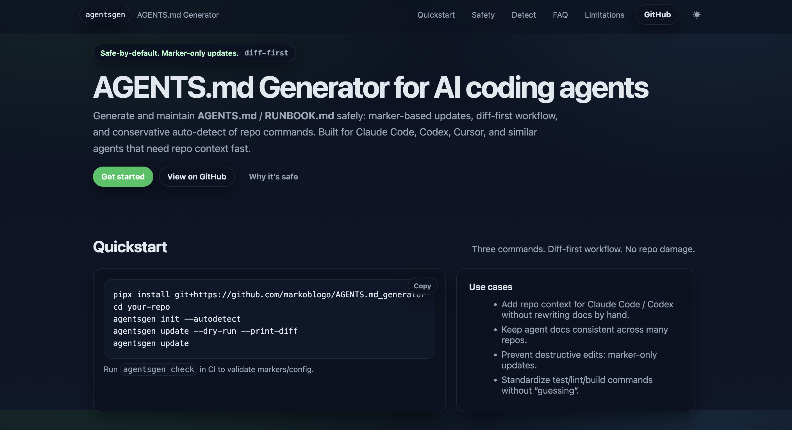

# AGENTS.md Generator (`agentsgen`)

**Agent contract layer for AI-ready repos.** `agentsgen` generates, updates, and checks repo instructions for coding agents without overwriting handwritten docs.

[](https://github.com/markoblogo/AGENTS.md_generator/actions/workflows/ci.yml)
[](https://github.com/markoblogo/AGENTS.md_generator/releases)
[](LICENSE)
[](pyproject.toml)
[](https://github.com/markoblogo/AGENTS.md_generator/actions/workflows/pages/pages-build-deployment)

60-second path:

```sh
pipx install agentsgen
agentsgen init . --defaults --autodetect
agentsgen check . --all --ci
```

Primary links:

- Landing: https://agentsmd.abvx.xyz/
- Agent discovery: https://agentsmd.abvx.xyz/.well-known/integrations.json
- Agent card: https://agentsmd.abvx.xyz/.well-known/agent-card.json
- Manifest: https://github.com/markoblogo/AGENTS.md_generator/blob/main/docs/manifest.md
- Listed on ABVX Lab: https://lab.abvx.xyz/



## What it does

Most agent tooling still asks teams to hand-maintain repo instructions, copy/paste prompts, and hope nothing drifts.
`agentsgen` turns that into a small, reviewable agent-readiness loop:

- **Bootstrap:** generate `AGENTS.md` and `RUNBOOK.md` from conservative repo detection or presets.
- **Enforce:** run `check`, `doctor`, and the GitHub Action guard to catch drift in PRs.
- **Serve agents:** emit `pack` docs, `agents.entrypoints.json`, `docs/ai/id-context.json`, and local MCP surfaces.
- **Fail safely:** update only inside explicit markers; write `*.generated.md` when a file is not marker-managed.

The product goal is simple: make any repo reliably interpretable by coding agents.

## Works great with

| Agent/tool | CLI docs | CI guard | Pack bundle | MCP surface |
| --- | --- | --- | --- | --- |
| Cursor | Yes | Yes | Yes | Local stdio |
| Claude Code | Yes | Yes | Yes | Local stdio |
| Codex | Yes | Yes | Yes | Local stdio |
| Copilot Workspace | Yes | Yes | Yes | Local stdio |
| Aider | Yes | Yes | Yes | Local stdio |

`agentsgen` is the repo-intelligence runtime in the ABVX ecosystem: use it directly in a repo, or call it through `SET` when you want one thin orchestration entrypoint.
It now ships a reliability-first core with split CLI/actions/understand modules, versioned JSON contracts across CLI and MCP surfaces, and opt-in LLM enhancement that falls back cleanly to local-only behavior.
Pair it with `ID` when you also need portable human-AI context and repo-local integration hooks across tools: `agentsgen pack` now emits a repo-local handoff manifest at `docs/ai/id-context.json` for that bridge. `ID` remains the human/profile layer: https://github.com/markoblogo/ID
That bridge now explicitly supports `soul.md` as the preferred fast human bootstrap layer, before expanding into fuller `ID` profile files.
Pair it with `abvx-agent-skills` when the agent needs reusable expert workflows for coding, frontend, audits, debugging, research, token economy, handoffs, and browser verification without bloating each repo's always-loaded AGENTS.md.

Small, production-grade CLI to generate and safely update:

- `AGENTS.md` (strict repo contract for coding agents)
- `RUNBOOK.md` (human-friendly command/run cheatsheet)
- proof-loop task artifacts under `docs/ai/tasks/`

## Why teams adopt it

| Option | Safe updates | Machine-readable output | Good for PR review | Repeatable across repos |
| --- | --- | --- | --- | --- |
| Handwritten `AGENTS.md` | No | No | Medium | Low |
| Ad-hoc prompt files | No | No | Low | Low |
| `agentsgen` | Yes | Yes | High | High |

Why not just write `AGENTS.md` by hand?

- Manual docs drift when commands, tooling, or repo layout changes.
- Handwritten context rarely gives agents structured entrypoints and machine-readable manifests.
- Reviewers need diffs and CI checks, not another prompt file to trust by memory.
- Marker ownership lets teams keep handcrafted prose while regenerating the boring parts.

## Adoption examples

| Repo shape | Before | After `agentsgen` |
| --- | --- | --- |
| Python CLI | Commands live in README, CI, and maintainer memory. | `AGENTS.md`, `RUNBOOK.md`, explicit test/build commands, PR guard. |
| Next.js app | Agent guesses package manager and scripts. | Preset-backed commands, pack docs, `agents.entrypoints.json`. |
| Monorepo | Mixed workspace context confuses agents. | Conservative detection, explicit config, per-repo guardrails without fake commands. |
| Docs-heavy repo | Long instructions bloat startup context. | Compact always-loaded contract plus on-demand `docs/ai` bundle. |

## References

- https://arxiv.org/abs/2602.11988
- https://arxiv.org/abs/2602.20478

## ABVX companion layers

- `agentsgen` owns repo-scoped agent context: AGENTS.md, RUNBOOK.md, pack docs, command manifests, and drift checks.
- `ID` owns portable human context: preferences, privacy, handshakes, and cross-tool continuity.
- `SET` owns workflow execution: CI entrypoint, orchestration, registry flows, and proof loops.
- `abvx-agent-skills` owns reusable agent capabilities: compact SKILL.md workflows for coding, frontend, audits, debugging, research, token economy, handoffs, and browser verification, with skill cards, attribution, validation, and risk gates.

## Agent discovery

The product site publishes small machine-readable discovery files for agents:

- `https://agentsmd.abvx.xyz/llms.txt`
- `https://agentsmd.abvx.xyz/.well-known/integrations.json`
- `https://agentsmd.abvx.xyz/.well-known/agent-card.json`

`integrations.json` declares the public docs, CLI install paths, GitHub Action surface, and the local-only MCP caveat. `agentsgen mcp` is intentionally a local stdio server, not a hosted remote MCP endpoint.

## Related projects

- `lab.abvx` is the public hub for the stack: https://github.com/markoblogo/lab.abvx
- `SET` is the thin orchestration layer: https://github.com/markoblogo/SET
- `ID` is the portable human-context layer: https://github.com/markoblogo/ID
- `abvx-agent-skills` is the reusable workflow layer: https://github.com/markoblogo/abvx-agent-skills
- `decision-map` is a related strategy protocol, not part of the core runtime: https://github.com/markoblogo/decision-map

## Safety Model

The tool is safe-by-default and follows a strict 3-mode policy per file:

1. File missing: create it with marker sections.
2. File exists and markers exist: update only content inside markers.
3. File exists but markers missing: do not modify it; write `*.generated.md` instead.

- Optional review guideline for coding agents: `docs/agent-guidelines.md`.

Marker format:

```md
<!-- AGENTSGEN:START section=commands -->
... generated content ...
<!-- AGENTSGEN:END section=commands -->
```

## Install

Homebrew:

```sh
brew install markoblogo/tap/agentsgen
```

Current stable install path:

```sh
pipx install agentsgen
```

Python package install:

```sh
pip install agentsgen
```

If PyPI is temporarily unavailable after the package is published, use GitVerse's PyPI mirror as a one-command fallback, not as a global default:

```sh
python -m pip install agentsgen --index-url https://pypi-mirror.gitverse.ru/simple/
```

Source install from GitHub:

```sh
pipx install git+https://github.com/markoblogo/AGENTS.md_generator.git
```

Contributor install:

```sh
python3 -m venv .venv
. .venv/bin/activate
pip install -e ".[dev]"
```

Optional experimental extras:

```sh
pip install -e ".[llm,mcp]"
```

## Quickstart

Canonical onboarding path for a new repo:

1. Install:

```sh
pipx install agentsgen
```

2. Bootstrap docs with autodetect:

```sh
agentsgen init . --defaults --autodetect
```

Or start from a built-in preset:

```sh
agentsgen init . --preset nextjs
```

3. Check readiness locally:

```sh
agentsgen check . --all --ci
```

Expected first outputs:

- `AGENTS.md`: strict repo contract for coding agents.
- `RUNBOOK.md`: human-readable command/run cheatsheet.
- `.agentsgen.json`: editable source config for generated sections.
- `*.generated.md`: safe fallback files when existing docs have no markers.

Then choose the mode you need:

- **CI mode:** add the PR guard workflow below.
- **AI visibility mode:** run `agentsgen pack . --autodetect`.
- **MCP mode:** run `agentsgen mcp` as a local stdio server.
- **Docs mode:** run `agentsgen snippets .` for README-safe extracts.

Add PR guard workflow (`.github/workflows/agentsgen-ci.yml`):

```yaml
name: agentsgen guard + pack check

on:
  pull_request:
  push:
    branches: [ main ]

permissions:
  contents: read
  pull-requests: write

jobs:
  agentsgen:
    runs-on: ubuntu-latest
    steps:
      - uses: actions/checkout@v4
      - uses: markoblogo/AGENTS.md_generator/.github/actions/agentsgen-guard@main
        with:
          comment: "true"
          files: "AGENTS.md,RUNBOOK.md"
          pack_check: "true"
          pack_format: "json"
```

Read-only repo snapshot:

```sh
agentsgen status .
```

Canonical README extracts for agents and CI:

```sh
agentsgen snippets .
```

Optional AI docs bundle:

```sh
agentsgen pack . --autodetect
cat agents.entrypoints.json
cat docs/ai/id-context.json
```

The generated `docs/ai/id-context.json` now tells `ID`-compatible consumers to start with `profiles/<owner>/soul.md`, then widen into `profile.core.md` and `handshake.md` only when necessary. In `SET`-orchestrated flows, that bridge can then be exported as a formal runtime packet at `docs/ai/id-bootstrap.json`.

Optional OKF export:

```sh
agentsgen okf export .
find docs/ai/okf -maxdepth 3 -type f | sort
```

Experimental local session reflection:

```sh
agentsgen reflect sessions .
cat docs/ai/agent-signals.json
agentsgen reflect skills .
cat docs/ai/skill-usage.json
```

Consumer-side path with `abvx-agent-skills`:

```text
agentsgen reflect sessions .
  -> docs/ai/agent-signals.json
  -> use skill: session-retrospective

agentsgen reflect skills .
  -> docs/ai/skill-usage.json
  -> docs/ai/skill-effectiveness.md
  -> use skill: skill-effectiveness-audit
```

For public website mode:

```sh
agentsgen pack . --site https://example.com
```

Companion guide for site-oriented AI visibility work: `docs/assets/llmo-quick-start.pdf`. For multi-repo orchestration, use `SET`: `https://github.com/markoblogo/SET`. For portable human-AI context across tools, pair with `ID`: `https://github.com/markoblogo/ID`

Result: fewer agent mistakes, safer updates, better indexable repo context, and a stable machine-readable surface for CI/MCP callers.

Deep dives:
- Action options: `docs/gh-action.md`
- Pack bundle details: `docs/llmo-pack.md`
- Free AI visibility guide (PDF): `docs/assets/llmo-quick-start.pdf`
- Release process: `docs/release-checklist.md`

## Demo

Fastest manual walkthrough:

```sh
mkdir -p /tmp/agentsgen-demo && cd /tmp/agentsgen-demo
agentsgen init . --defaults --autodetect
agentsgen status .
agentsgen snippets .
agentsgen check . --all --ci
```

Extended demo notes: [`demo/README.md`](demo/README.md)

## Presets

Presets are conservative starter `.agentsgen.json` templates for common repo shapes.
Use them to get explicit commands quickly, then edit the generated config to match your real toolchain. Pair them with `agentsgen status` for a read-only snapshot and `agentsgen snippets` for canonical README extracts.

```sh
agentsgen presets
agentsgen init . --preset nextjs
agentsgen init . --preset cli-python
```

## Recipes

Copy-paste starter kits (each includes an example `.agentsgen.json` with explicit commands + a PR Guard workflow snippet):
Pick one → copy .agentsgen.json to your repo root → run: agentsgen init . --defaults --autodetect

- **Python library (Poetry + pytest):** [`recipes/python-lib/`](recipes/python-lib/)
- **Next.js app (pnpm):** [`recipes/nextjs-app/`](recipes/nextjs-app/)
- **JS monorepo (workspaces):** [`recipes/monorepo-js/`](recipes/monorepo-js/)
- **Node CLI tool:** [`recipes/cli-tool/`](recipes/cli-tool/)

## GitHub Action: PR Guard

Use the reusable `agentsgen-guard` action to fail PRs when `AGENTS.md` / `RUNBOOK.md` are missing or out of date.

```yaml
name: agentsgen-guard

on:
  pull_request:

permissions:
  contents: read
  # pull-requests: write  # only if comment: "true"

jobs:
  guard:
    runs-on: ubuntu-latest
    steps:
      - uses: actions/checkout@v4
      - uses: markoblogo/AGENTS.md_generator/.github/actions/agentsgen-guard@main
        with:
          path: "."
          files: "AGENTS.md,RUNBOOK.md"
          comment: "true"
          pack_check: "true"
          pack_format: "json"
          # pack_autodetect: "true"
          # pack_llms_format: "md"
          # pack_output_dir: "docs/ai"
          # pack_files: |
          #   llms
          #   SECURITY_AI.md
```

- Optional PR comment: use `comment: "false"` if you prefer log-only mode.
- Fork-safe by default: no extra secrets required.
- Most users only need these inputs: `comment`, `files`, `pack_check`.
- Advanced knobs: `pack_format`, `pack_autodetect`, `pack_llms_format`, `pack_output_dir`, `pack_files`.
- `files` input is an action-level filter for reported file findings; core validation still runs through `check_repo`.
- `pack_check: "true"` enforces `agentsgen pack --autodetect --check` in the same guard run.
- `pack` is still supported as a backward-compatible alias (deprecated; prefer `pack_check`).
- Example workflow: `.github/workflows/agentsgen-guard.example.yml`
- Full action docs: `docs/gh-action.md`

## Usage

```sh
agentsgen init
agentsgen presets
agentsgen init . --preset nextjs
agentsgen update
agentsgen pack
agentsgen snippets .
agentsgen snippets . --check
agentsgen check
agentsgen check . --pack-check
agentsgen check . --all --ci
agentsgen check . --format json
agentsgen doctor . --all --ci
agentsgen status .
agentsgen status . --format json
agentsgen detect . --format json
agentsgen analyze https://example.com
agentsgen meta https://example.com
agentsgen task init proof-loop-v0 . --summary "Capture proof artifacts for this task"
agentsgen task evidence proof-loop-v0 . --check "pytest=passed" --check "ruff=passed"
agentsgen task verdict proof-loop-v0 . --status needs-review --summary "Manual review still pending"
agentsgen init --defaults --stack python --dry-run --print-diff
pipx uninstall agentsgen
```

agentsgen status is a read-only overview of managed files, markers, generated fallbacks, and pack drift.
It is lighter and more diagnostic than `agentsgen check`, which focuses on repo readiness errors/warnings.
`agentsgen doctor` is an exact alias for `agentsgen check`.
Invalid `.agentsgen.json` files now fail as structured CLI errors instead of raw tracebacks.
`agentsgen status --format json` includes pack-level findings and pack-level errors for machine consumers.
`agentsgen task evidence` and `agentsgen task verdict` now write richer summaries for checks, artifacts, decision state, and review readiness under `docs/ai/tasks/<task-id>/`.

`agentsgen check` can also aggregate optional drift checks:
- `agentsgen check . --pack-check` adds `pack --check`
- `agentsgen check . --all` enables both pack and snippets checks
- `agentsgen check . --format json` emits a stable machine-readable payload
- `agentsgen check . --ci` prints a compact CI summary without path-heavy log noise
- `agentsgen pack . --site https://example.com` generates a site-oriented `llms.txt` from the homepage and sitemap

## Experimental surfaces

These features are opt-in and do not change the default local-only CLI path.

- `agentsgen init . --llm-enhance --llm-provider openai`
- `agentsgen update . --llm-enhance --llm-provider anthropic`
- `agentsgen mcp`

Experimental notes:

- `--llm-enhance` only appends narrative context sections grounded in local `understand` artifacts.
- Provider failures and timeouts fall back to local-only generation.
- MCP currently exposes read and write tools with versioned JSON contracts for `status`, `check`, `detect`, `understand`, `init`, `update`, and `pack`.
- Install optional extras first: `pip install -e ".[llm,mcp]"`.
- Provider-specific notes: `docs/experimental-llm.md`.

## README Snippets (mini-validator)

Use snippet markers in `README.md` to define canonical agent-facing extracts without editing generated output by hand.
The command writes `README_SNIPPETS.generated.md`.

Marker format:

```md
<!-- AGENTSGEN:SNIPPET name=install -->
python -m pip install -e ".[dev]"
<!-- AGENTSGEN:ENDSNIPPET -->
```

```sh
agentsgen snippets .
agentsgen snippets . --check
```

## Proof-loop v0

For larger tasks, `agentsgen` can keep a lightweight proof bundle in-repo:

- `docs/ai/tasks/<task-id>/contract.md`
- `docs/ai/tasks/<task-id>/evidence.json`
- `docs/ai/tasks/<task-id>/verdict.json`

```sh
agentsgen task init proof-loop-v0 . --summary "Capture proof artifacts for this task"
agentsgen task evidence proof-loop-v0 . --check "pytest=passed"
agentsgen task verdict proof-loop-v0 . --status needs-review --summary "Manual review still pending"
```

## Pack bundle

`agentsgen pack` generates an AI-readable documentation bundle:

- `llms.txt` (or `LLMS.md` with `--llms-format md`)
- `agents.entrypoints.json` (machine-readable command manifest for agents/CI)
- `docs/ai/id-context.json` (machine-readable repo handoff manifest for `ID`-compatible flows)
- `docs/ai/how-to-run.md`
- `docs/ai/how-to-test.md`
- `docs/ai/architecture.md`
- `docs/ai/data-contracts.md`
- `SECURITY_AI.md`
- `CONTRIBUTING_AI.md`
- `README_SNIPPETS.md`

New:
- `agents.entrypoints.json` — a machine-readable manifest of repo commands (install/test/lint/build/run) derived from `.agentsgen.json` / autodetect.
- `docs/ai/id-context.json` — a repo-scoped handoff manifest that gives `ID` a stable entrypoint into repo docs, command manifests, repomap artifacts, and proof-loop surfaces.

By default, pack writes AI docs into docs/ai/ (override via pack_output_dir).
Use --print-plan to preview what pack will write.

What it is:
- a compact, agent-first context bundle for coding agents and LLM indexing.

## Experimental OKF export

`agentsgen okf export` derives an [Open Knowledge Format](https://github.com/GoogleCloudPlatform/knowledge-catalog/tree/main/okf) style markdown bundle from the repo-local AI docs that `agentsgen pack` already generates.

Current export target:

- `docs/ai/okf/index.md`
- `docs/ai/okf/repo/overview.md`
- `docs/ai/okf/repo/architecture.md`
- `docs/ai/okf/repo/runbook.md`
- `docs/ai/okf/repo/test-flow.md`
- `docs/ai/okf/repo/contracts.md`
- `docs/ai/okf/assets/entrypoints.md`

Usage:

```sh
agentsgen pack . --autodetect
agentsgen okf export .
agentsgen okf export . --check
```

Why it exists:

- keep `docs/ai/` as the primary repo-facing output
- add a portable markdown+frontmatter bundle for downstream catalogs, viewers, and agents
- avoid turning OKF into a required internal source format too early

## Repo understanding artifacts

`agentsgen understand` generates a deterministic repo map, compact token-budgeted map, import graph, and machine-readable knowledge file.
It uses local heuristics only: no network calls, no LLM calls.
Artifacts are written with the same safe update policy used elsewhere in `agentsgen`.

`agentsgen understand .`
`agentsgen understand . --compact-budget 4000`
`agentsgen understand . --focus cli`
`agentsgen understand . --changed`

Artifacts:
- `docs/ai/repomap.md`
- `docs/ai/repomap.compact.md`
- `docs/ai/graph.mmd`
- `agents.knowledge.json`

`repomap.compact.md` ranks files by import graph signals, entrypoint proximity, and local git changes, then trims the output to an approximate token budget for agent context handoff.
Use `--focus <query>` for a query-specific slice, or `--changed` to bias the compact map toward current git changes and their immediate import neighbors.

What it is not:
- not a traffic/SEO promise, and not a full developer handbook replacement.

`agentsgen analyze` audits a public URL and writes `docs/ai/llmo-score.json`.
It uses deterministic heuristics by default and can add an optional advisory AI review with `--use-ai`.

`agentsgen meta` generates `docs/ai/llmo-meta.json` with AI-oriented title, description, keywords, and short description suggestions for a public URL.

Companion guide for these public-site workflows: `docs/assets/llmo-quick-start.pdf`.

### Why it matters
- **Less agent babysitting.** Repos with `AGENTS.md` + `docs/ai/` reduce back-and-forth and "where is X?" questions for Codex/Claude.
- **Safer automation by default.** Marker-only updates + `*.generated.*` fallback prevents accidental overwrites of hand-written docs.
- **CI keeps it honest.** `agentsgen-guard` + `agentsgen pack --check` catches drift early, before docs rot and agents start hallucinating.

Safety model is identical to `init`/`update`:

1. Missing file -> create with markers.
2. Existing file with markers -> update only marker sections.
3. Existing file without markers -> keep original and write `*.generated.*`.

See full details: `docs/llmo-pack.md`.

## Known Limitations

- Auto-detect is intentionally conservative (file heuristics only; no “smart” analysis).
- Monorepos may detect as `mixed`, and commands can be empty on purpose (better empty than wrong).
- If a Makefile exists, Makefile targets win over other toolchains by design.
- Templates are still intentionally minimal: `python`, `node`, `static`.
- The tool only owns content inside `AGENTSGEN` marker sections; keep custom content outside markers.

## Landing Page (GitHub Pages)

This repo includes a minimal one-page landing in `docs/index.html`.

- GitHub: Settings -> Pages
- Source: Deploy from a branch
- Branch: `main`
- Folder: `/docs`

## Experimental: ASCII theme (landing)

- The landing page includes an experimental ASCII theme as a visual/UX experiment.
- Toggle it from the header next to the light/dark switch.
- The setting is saved in localStorage.
- This is UI-only and does not affect the generator output.
- Reuse pointers:
  - `docs/ascii/ascii.css`
  - `docs/ascii/ascii.js`

## Snapshot Commits

If you want cheap “backup commits” with a green-test gate:

```sh
make snapshot
```

This runs `ruff format`, `ruff check`, `pytest`, then commits only if there are changes and tests are green.

## Local Smoke

Run the built-in smoke entrypoint directly from the activated virtualenv:

```sh
python -m agentsgen._smoke
pytest -q
```

Release automation uses the same smoke entrypoint before tagging.

## Definition Of Done (DoD)

- `agentsgen init` works in an empty folder and creates:
  - `.agentsgen.json`
  - `AGENTS.md`
  - `RUNBOOK.md`
- `agentsgen update`:
  - updates only marker sections
  - preserves content outside markers
  - writes `*.generated.md` if markers are missing
- `agentsgen check` returns non-zero exit code on problems
- 3 builtin smoke tests exist: `python -m agentsgen._smoke`
  - init in empty dir creates files
  - edit outside markers persists after update
  - no-markers files produce `*.generated.md` and leave originals untouched
- recommended local smoke entrypoint: `python -m agentsgen._smoke`

## Contributing

Template PRs welcome (shared sections and stack-specific notes).

## Releasing

- Use checklist: `docs/release-checklist.md`
- Run releases from an activated venv (`. .venv/bin/activate`); the script also auto-prefers `.venv/bin/python` when present.
- Write release notes: `RELEASES/template.md -> RELEASES/vX.Y.Z.md`
- Run: `./scripts/release.sh vX.Y.Z A|B|C`
- Shorthand: `./scripts/release.sh A` (auto-suggests next version)
- Tags follow `vX.Y.Z` and should point to the release commit
